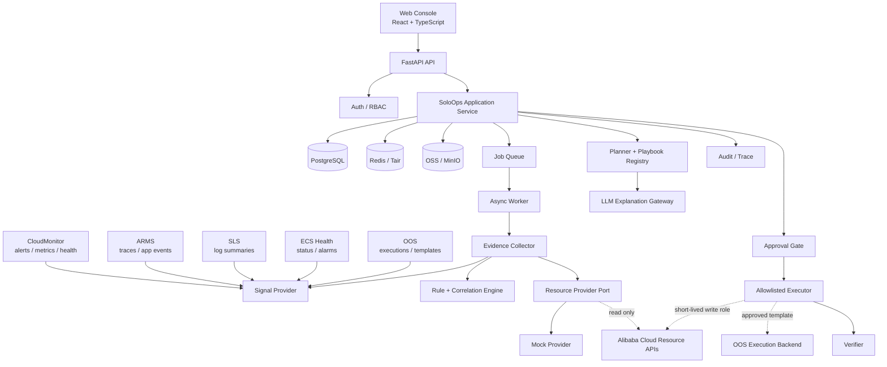
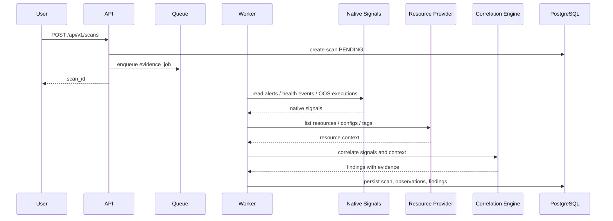
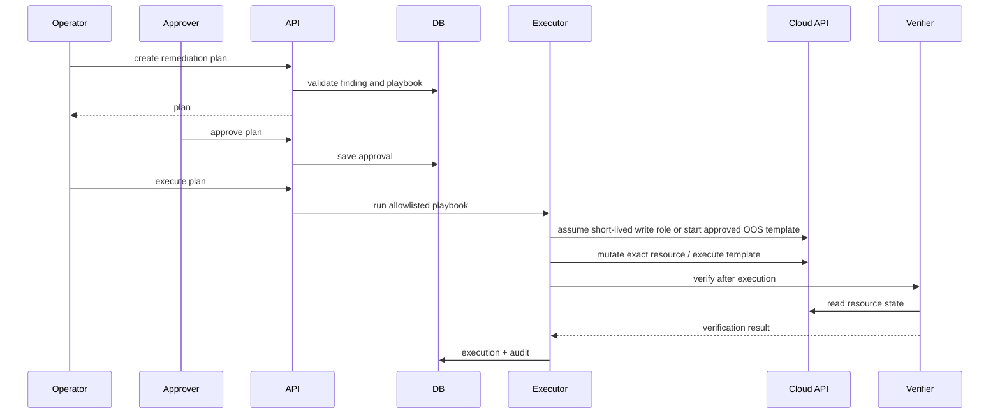
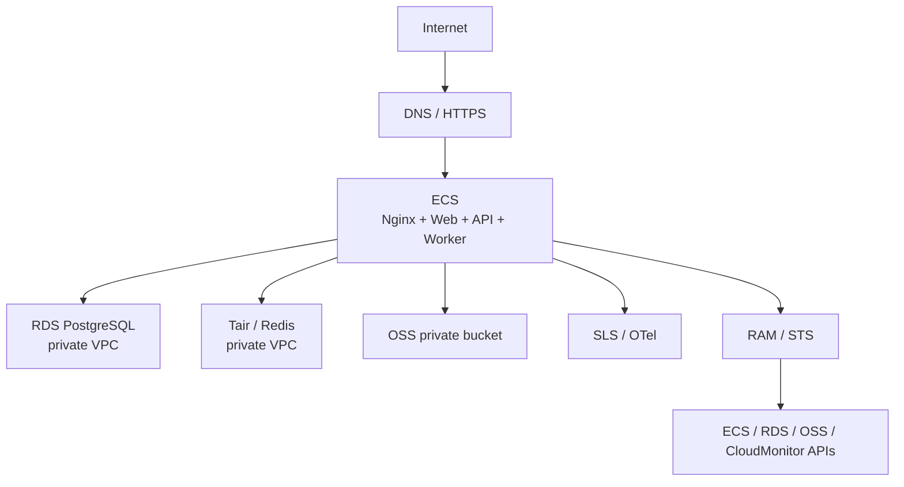

# 系统架构设计

## 1. 架构目标

- 支持从本地 Mock 演示平滑演进到阿里云原生信号接入。
- 将原生信号 Provider、资源 Provider、规则/归因引擎、Planner、审批和执行器解耦。
- 优先复用 CloudMonitor、ARMS、SLS、ECS 健康检查和 OOS，不重复建设基础监控与通用编排平台。
- 保证任何写动作都经过权限、审批、白名单和幂等校验。
- 让扫描、模型调用、执行验证等长任务异步化。
- 为秋招展示保留清晰的架构图、数据模型、Trace 和部署拓扑。

## 2. 总体架构



## 3. 服务职责

| 模块 | 职责 | 不负责 |
| --- | --- | --- |
| Web Console | 风险看板、详情、审批、审计查询 | 直接访问云 API |
| API | 鉴权、资源 CRUD、触发任务、返回 OpenAPI | 长时间扫描和执行 |
| Application Service | Finding 生命周期、计划、审批、状态流转 | 云 SDK 细节 |
| Signal Provider | 读取 CloudMonitor/ARMS/SLS/ECS/OOS 原生信号 | 自建监控采集链路 |
| Resource Provider | 拉取资源快照、配置和标签 | 生成写操作 |
| Evidence Collector | 合并告警、健康事件、资源、配置和部署上下文 | 替代 CloudMonitor/ARMS/SLS |
| Rule + Correlation Engine | 确定性规则、告警归并、去重、严重级别 | 调用 LLM 自由判断 |
| Planner | 根据 Playbook 生成修复计划 | 绕过白名单 |
| LLM Gateway | 风险解释、摘要、面向用户的说明 | 决定是否执行 |
| Approval Gate | 审批校验、职责分离、审批记录 | 修改执行参数 |
| Executor | 执行受控 Playbook、调用已批准 OOS 模板、幂等、回滚入口 | 任意 Shell/SSH |
| Verifier | 执行后重新读取证据并验证 | 只凭执行返回值判断成功 |
| Audit | 保存 Trace、操作者、资源、动作、结果 | 存储密钥和敏感原文 |

## 4. 核心时序

### 4.1 归并 Finding



### 4.2 审批执行



## 5. 分层设计

```text
app/
  api/              HTTP handlers, request/response schema
  domain/           entities, value objects, state machine
  application/      use cases: scan, plan, approve, execute
  providers/        cloud provider ports and adapters
  rules/            deterministic checks
  playbooks/        allowlisted remediation definitions
  workers/          async jobs
  persistence/      repository implementations
  observability/    logging, metrics, trace
```

当前代码仍是轻量 MVP 结构，后续开发可按以上分层演进，而不是一次性重构。

## 6. 关键架构决策

### ADR-001：原生信号先于自研采集

CloudMonitor、ARMS、SLS、ECS 健康检查和 OOS 已经覆盖大量监控、告警和自动化能力。SoloOps 优先读取这些原生信号，只在 Mock、本地开发或业务特定上下文中补充轻量采集。

### ADR-002：规则引擎先于 LLM

运维风险必须可解释、可复现。首版 Finding 由确定性规则生成；LLM 只基于已保存证据生成解释和沟通文案。

### ADR-003：执行器只接受 Playbook

Executor 不接受自然语言命令，不接受任意 Shell，不接受模型拼接的 API 参数。所有动作由 Playbook Registry 定义输入 Schema 和权限边界；真实执行可以调用 OOS 模板，但模板 ID、参数 Schema 和权限必须预登记。

### ADR-004：读写 Provider 分离

`CloudProvider` 只读接口用于扫描；写动作通过单独的 `ExecutionAdapter`，并且只在审批后用短时写角色初始化。

### ADR-005：长任务异步化

真实扫描、指标拉取、LLM 解释、执行验证都可能受外部服务影响。API 只负责创建任务和查询状态，Worker 负责实际执行。

### ADR-006：审计链不可变

审批、执行和验证记录不原地覆盖；状态变化通过事件和追加记录表达，便于复盘。

## 7. 本地与生产部署

### 本地开发

Docker Compose 启动 API、Web、Worker、PostgreSQL、Redis、MinIO。Mock Provider 默认开启，真实云 Provider 需要显式配置环境变量。

### 首期生产



ECS 只承载无状态应用和 Worker；数据库、缓存和对象存储使用托管服务。RDS/Tair 不暴露公网。

## 8. 可观测性

每个请求、扫描任务、Finding、计划、审批和执行贯穿：

- `request_id`
- `trace_id`
- `scan_id`
- `finding_id`
- `plan_id`
- `execution_id`
- `tenant_id`
- `resource_id`

日志不记录 AccessKey、STS Token、数据库密码、原始敏感日志。Trace 只保存摘要、引用和必要元数据。
