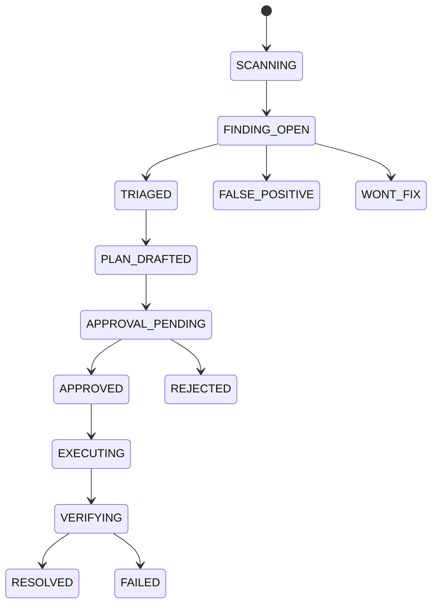

# Agent 与 Playbook 设计

## 1. 设计目标

SoloOps 的 Agent 不是自由聊天机器人，而是运行在受控状态机上的运维协作者。它可以解释证据、汇总风险、生成计划说明和提示人工决策，但不能绕过规则引擎、审批系统和 Playbook 白名单。

## 2. Agent 分工

| Agent | 输入 | 输出 | 权限 |
| --- | --- | --- | --- |
| Triage Agent | Finding、证据、历史记录 | 风险解释、影响范围、优先级建议 | 只读 |
| Planner Agent | Finding、Playbook Schema、资源上下文 | 修复计划草案和注意事项 | 只读，不能新增动作 |
| Reviewer Agent | 计划、审批策略、风险等级 | 审批辅助摘要、问题清单 | 只读 |
| Verifier Agent | 执行前后证据、规则定义 | 验证结论、残留风险 | 只读 |
| Postmortem Agent | 扫描、执行、日志摘要 | 复盘报告、预防建议 | 只读 |

MVP 可以先不接入真实 LLM，用模板和确定性摘要完成同样的结构；后续再把 Agent 输出接入 LLM Gateway。

## 3. 状态图



## 4. 工具调用原则

- Agent 只能调用注册工具，工具有明确输入 Schema。
- 工具分为 `read_tool`、`plan_tool`、`approval_tool`、`execution_tool`。
- LLM 不直接接触密钥，不直接构造云 SDK 客户端。
- 工具输出必须结构化，并保存为 Trace。
- 任何写工具调用前必须存在审批记录和幂等键。

## 5. Playbook 契约

每个 Playbook 是可执行动作的唯一来源，定义如下：

```json
{
  "id": "revoke_public_postgres_rule",
  "version": "1.0.0",
  "risk_level": "high",
  "description": "Remove only an exact public TCP/5432 ingress rule.",
  "input_schema": {
    "security_group_id": "string",
    "protocol": "tcp",
    "port_range": "5432/5432",
    "source_cidr": "0.0.0.0/0"
  },
  "required_approval": true,
  "required_permissions": [
    "ecs:DescribeSecurityGroupAttribute",
    "ecs:RevokeSecurityGroup"
  ],
  "precheck": [
    "security group exists",
    "exact rule exists",
    "rule matches finding evidence"
  ],
  "steps": [
    "save original rule",
    "revoke exact ingress rule",
    "read security group again"
  ],
  "verification": [
    "exact public postgres rule no longer exists",
    "unrelated rules are unchanged"
  ],
  "rollback": [
    "restore saved original rule after explicit approval"
  ]
}
```

## 6. 首批 Playbook

### 6.1 revoke_public_postgres_rule

- 目标：撤销公网开放 PostgreSQL 的精确安全组规则。
- 风险：可能影响合法外部数据库访问。
- 防护：只删除与 Finding 证据完全一致的规则；不删除整个安全组。
- 验证：重新读取安全组，确认 `0.0.0.0/0` 到 `5432/5432` 不存在。

### 6.2 collect_disk_diagnosis

- 目标：采集磁盘占用、挂载点、最大目录摘要。
- 风险：只读，低风险。
- 防护：不执行删除文件、清理日志等动作。
- 验证：诊断包保存到对象存储或数据库引用中。

### 6.3 collect_container_diagnosis

- 目标：采集容器重启次数、最近退出码、镜像版本和日志元数据。
- 风险：只读，低风险。
- 防护：不重启容器，不修改 Compose 文件。
- 验证：诊断结果关联 Finding。

### 6.4 trigger_rds_backup

- 目标：触发指定 RDS 实例的一次手动备份。
- 风险：可能带来费用和短时资源压力。
- 防护：必须审批；限制实例 ID；执行前检查最近备份状态。
- 验证：备份任务创建成功并进入可查询状态。

## 7. Prompt 设计原则

LLM 提示词必须包含：

- 当前角色：解释、计划、复盘，而不是执行。
- 输入证据：Finding、资源、指标、规则说明。
- 输出 Schema：固定 JSON 字段。
- 禁止项：不生成 Shell，不建议绕过审批，不编造证据。
- 不确定性：缺少证据时必须输出 `needs_more_evidence`。

示例输出：

```json
{
  "summary": "PostgreSQL is publicly reachable from the internet.",
  "impact": "Attackers can attempt password brute force or exploit exposed database services.",
  "confidence": "high",
  "needs_more_evidence": false,
  "recommended_playbook": "revoke_public_postgres_rule",
  "human_questions": [
    "Is there a legitimate external client that requires direct PostgreSQL access?"
  ]
}
```

## 8. 评测样例

| Case | 输入 | 期望 |
| --- | --- | --- |
| Public Postgres | SG-001 Finding | 推荐安全组撤销 Playbook，不生成删除实例建议 |
| Disk High | ECS-001 Finding | 推荐只读诊断，不建议直接删除日志 |
| Restart Loop | ECS-002 Finding | 推荐采集容器诊断，不建议直接重启 |
| Missing Evidence | 只有自然语言描述 | 输出需要更多证据 |
| Unknown Action | Finding action 不在白名单 | 拒绝生成可执行计划 |

## 9. 安全红线

- 不输出可直接复制执行的破坏性 Shell。
- 不建议关闭审计、关闭告警、扩大权限。
- 不把模型置信度当作执行条件。
- 不允许 Agent 修改 Playbook Registry。
- 不允许 Agent 在审批后改变目标资源或动作。
