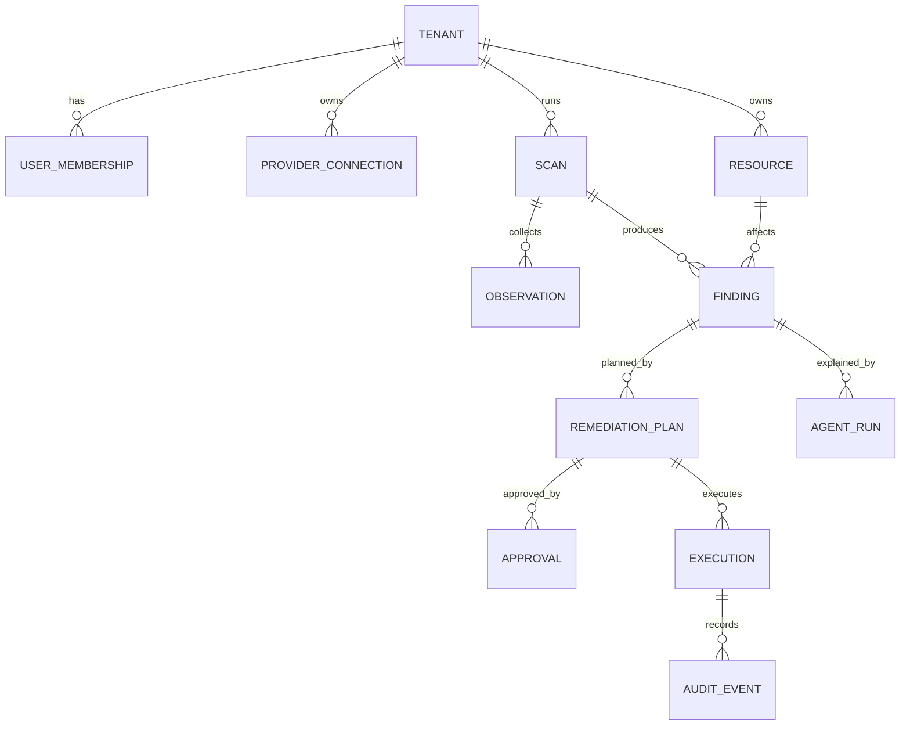

# 数据与接口设计

## 1. 核心实体



## 2. 表设计摘要

| 表 | 关键字段 | 说明 |
| --- | --- | --- |
| `tenants` | id, name, status, created_at | 工作区 |
| `users` | id, email, name, created_at | 用户 |
| `memberships` | tenant_id, user_id, role | 成员和角色 |
| `provider_connections` | id, tenant_id, provider, region, status, config_json | 云连接配置，不保存明文密钥 |
| `resources` | id, tenant_id, provider, resource_type, external_id, name, region, tags_json, last_seen_at | 云资源快照索引 |
| `scans` | id, tenant_id, provider, status, started_at, completed_at, error_json | 扫描任务 |
| `observations` | id, scan_id, resource_id, source, observed_at, summary, payload_json | 指标、配置和运行证据 |
| `findings` | id, tenant_id, scan_id, resource_id, rule_id, title, severity, status, evidence_refs_json | 风险项 |
| `remediation_plans` | id, finding_id, playbook_id, action, target_resource_id, rationale, expected_impact, rollback_json, status | 修复计划 |
| `approvals` | id, plan_id, approver_id, decision, comment, decided_at | 审批记录 |
| `executions` | id, plan_id, status, idempotency_key, started_at, completed_at, verification_json | 执行记录 |
| `audit_events` | id, tenant_id, actor_id, entity_type, entity_id, action, payload_json, created_at | 不可变审计事件 |
| `agent_runs` | id, tenant_id, finding_id, trace_id, agent_type, model, input_refs_json, output_json, cost, status | Agent Trace |

所有表使用 UUID 主键；所有租户内查询必须带 `tenant_id`；`audit_events` 和 `approvals` 原则上不做物理删除。

## 3. 状态枚举

### ScanStatus

`PENDING / RUNNING / SUCCEEDED / FAILED / CANCELED`

### FindingStatus

`OPEN / ACKED / PLANNED / APPROVED / EXECUTING / RESOLVED / FAILED / WONT_FIX / FALSE_POSITIVE`

### PlanStatus

`DRAFT / PENDING_APPROVAL / APPROVED / REJECTED / EXECUTED / CANCELED`

### ExecutionStatus

`PENDING_APPROVAL / APPROVED / RUNNING / SUCCEEDED / FAILED / REJECTED`

## 4. API 原则

- 所有接口使用 `/api/v1`。
- 写接口要求 `Idempotency-Key`，避免重复执行。
- 错误响应使用统一格式：`code / message / details / request_id`。
- 列表接口支持分页：`limit / cursor`。
- 所有时间使用 UTC ISO 8601。
- 客户端不能传入可信 `tenant_id`，由鉴权上下文决定。

## 5. 核心 API

| Method | Path | 说明 |
| --- | --- | --- |
| GET | `/healthz` | 健康检查 |
| POST | `/api/v1/scans` | 创建扫描任务 |
| GET | `/api/v1/scans/{scan_id}` | 查询扫描状态和摘要 |
| GET | `/api/v1/findings` | 查询 Finding 列表 |
| GET | `/api/v1/findings/{finding_id}` | 查询 Finding 详情 |
| POST | `/api/v1/findings/{finding_id}/ack` | 确认已知风险 |
| POST | `/api/v1/findings/{finding_id}/plans` | 创建修复计划 |
| GET | `/api/v1/plans/{plan_id}` | 查询计划详情 |
| POST | `/api/v1/plans/{plan_id}/approve` | 审批通过 |
| POST | `/api/v1/plans/{plan_id}/reject` | 审批拒绝 |
| POST | `/api/v1/plans/{plan_id}/execute` | 执行已审批计划 |
| GET | `/api/v1/executions/{execution_id}` | 查询执行结果 |
| GET | `/api/v1/audit-events` | 查询审计日志 |
| GET | `/api/v1/resources` | 查询资源快照 |
| GET | `/api/v1/playbooks` | 查询白名单 Playbook |

## 6. 请求响应示例

### 创建扫描

```json
POST /api/v1/scans
{
  "provider": "mock",
  "scope": {
    "regions": ["cn-hangzhou"],
    "resource_types": ["ecs", "security_group", "rds"]
  }
}
```

响应：

```json
{
  "id": "scan_01",
  "provider": "mock",
  "status": "RUNNING",
  "started_at": "2026-07-16T10:00:00Z"
}
```

### Finding 详情

```json
{
  "id": "finding_01",
  "rule_id": "SG-001",
  "title": "PostgreSQL is publicly reachable",
  "severity": "critical",
  "resource_id": "sg-redflow-db",
  "status": "OPEN",
  "description": "An ingress rule exposes PostgreSQL to every internet address.",
  "evidence": [
    {
      "source": "security_group",
      "observed_at": "2026-07-16T10:00:00Z",
      "summary": "Public TCP/5432 ingress",
      "payload": {
        "protocol": "tcp",
        "port_range": "5432/5432",
        "source_cidr": "0.0.0.0/0"
      }
    }
  ],
  "remediation_action": "revoke_public_postgres_rule"
}
```

### 审批计划

```json
POST /api/v1/plans/plan_01/approve
{
  "approver": "owner@example.com",
  "comment": "Confirmed no external client should access PostgreSQL directly."
}
```

### 执行计划

```json
POST /api/v1/plans/plan_01/execute
Idempotency-Key: exec-plan-01-20260716
```

响应：

```json
{
  "id": "exec_01",
  "plan_id": "plan_01",
  "status": "SUCCEEDED",
  "verification": {
    "result": "passed",
    "message": "Exact public PostgreSQL rule no longer exists."
  },
  "audit": [
    "approval verified",
    "playbook input matched finding evidence",
    "post-check passed"
  ]
}
```

## 7. 领域事件

| 事件 | 触发时机 |
| --- | --- |
| `ScanRequested` | 用户创建扫描 |
| `ScanCompleted` | 扫描完成 |
| `FindingOpened` | 新风险被发现 |
| `FindingDeduplicated` | 风险被去重合并 |
| `PlanCreated` | 修复计划创建 |
| `PlanApproved` | 计划审批通过 |
| `PlanRejected` | 计划被拒绝 |
| `ExecutionStarted` | 执行开始 |
| `ExecutionSucceeded` | 执行成功并验证通过 |
| `ExecutionFailed` | 执行或验证失败 |
| `FindingResolved` | Finding 关闭 |

消费者必须幂等；事件只传 ID 和必要摘要，大型证据通过数据库或对象存储引用读取。

## 8. 当前代码映射

| 当前文件 | 后续目标 |
| --- | --- |
| `app/domain.py` | 拆分为领域实体和 API Schema |
| `app/api.py` | 扩展为 router 分组和鉴权中间件 |
| `app/scanner.py` | 演进为 Scanner + Rule Engine |
| `app/providers.py` | 拆分为 Provider port、Mock adapter、Aliyun adapter |
| `app/service.py` | 拆分为 ScanService、PlanService、ApprovalService、ExecutionService |
| `app/store.py` | 替换为 PostgreSQL Repository |
