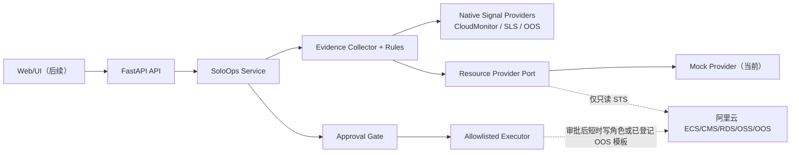

# SoloOps 架构与实施路线

## MVP 架构

## 数据演进

当前代码使用 SQLAlchemy Repository，持久化存储统一使用 MySQL：

- `resources`：资源快照与标签。
- `observations`：指标/配置证据，按时间分区。
- `findings`：规则、严重性、状态和证据引用。
- `remediation_plans`、`approvals`、`executions`：不可变审计链。
- `agent_runs`：模型、Prompt、工具调用、成本和 Trace。

原始日志放 OSS；关系数据和元数据放 MySQL/RDS MySQL；短期队列/锁/缓存放 Tair。ECS 只部署 API/worker/代理，避免把数据库或唯一备份留在本机磁盘。

## 三阶段计划

### Phase 1：可信只读 MVP（当前，1–2 周）

- 完成 Mock API、规则、审批、测试和 Docker Compose。
- 实现真实 CloudMonitor 告警/指标、ECS 健康状态、安全组读取和 OOS 执行记录读取。
- 首批规则：公网数据库端口、磁盘、容器重启、证书到期、备份过期。

### Phase 2：受控变更（2–3 周）

- MySQL + Redis 持久化；登录/RBAC；审批 UI。
- STS 读/写角色，短时会话策略；操作审计。
- 两个真正可执行且可回滚的 Playbook：撤销指定风险安全组规则、触发/验证备份。

### Phase 3：应用运维 Agent（3–4 周）

- 接入 Docker/Compose 清单、部署版本、OTel/SLS 日志。
- CloudMonitor/ARMS/SLS/OOS 信号—资源—服务—部署版本—告警的证据图谱。
- 成本归因、异常检测、变更风险评分与故障注入评测。

## 部署

本地：`docker compose up --build`。  
线上：ECS 或宝塔部署 API/Worker，MySQL/RDS MySQL、Tair、OSS 优先使用私网；ACR 承载镜像；SLS/OTel 记录观测数据。安全组只开 80/443 和受限 SSH，生产数据库不建议开放公网。
